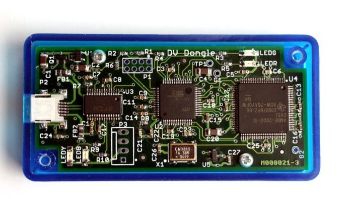
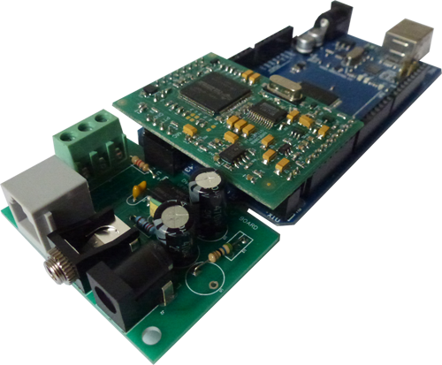

# go-dv
Golang Digital Voice modem support.

## Supported modems

### AMBE2000 DV Dongle

Supported modes:
 * D-Star

### AMBE3000 Multi-Mode Digital Voice Modem

Supported modes:
 * D-Star
 * DMR
 * System Fusion
